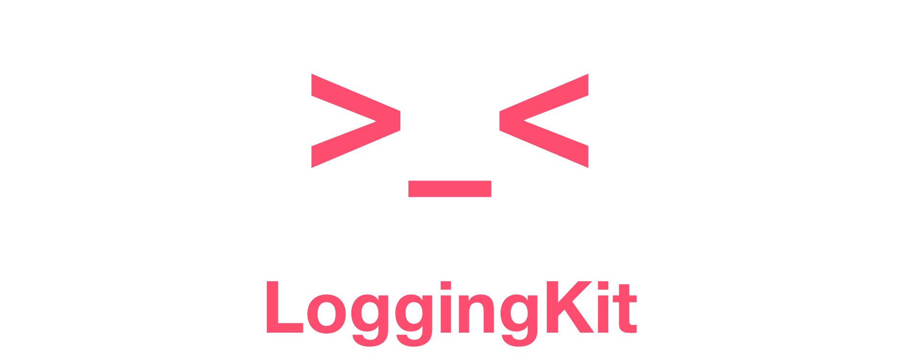

<p align="center">
  
</p>

Simple logging kit written in Swift, based on [apple/swift-log](https://github.com/apple/swift-log) framework.

## Usage

1. Bootstrap logging system globally

```swift
// AppDelegate.swift
import LoggingKit
import UIKit

@UIApplicationMain
class AppDelegate: UIResponder, UIApplicationDelegate {
    static let logs = Box<[Log]>()
    func application(..., didFinishLaunchingWithOptions...) -> Bool {
        LoggingSystem.bootstrap(level: .info, output: Self.logs)
    }
    // ...
}
```
2. Passthrough convenience types

```swift
// LoggingKit.swift
import LoggingKit

typealias Loggable = LoggingKit.Loggable
typealias Log = LoggingKit.Log
```

3. Log

```swift
class ProfileViewModel: Loggable {
    // ...
    func logout() {
        userManager.logout(
            onSuccess: { [weak self] in
                self?.coordinator.go(to: .signIn)
                Self.logger.trace("User signed out.")
            }, 
            onFailure: { [weak self] error in
                Self.logger.trace("User logout failed.")
                Self.logger.info(.dump(error))
            })
    }
}
```

4. Grab logs

```swift
class LoggingViewModel {
    var logs: [Log] { AppDelegate.logs.content }
}
```

5. See  **[Examples](./Examples)** for more.

## Installation

Add the package to Your SwiftPM package dependencies:

```swift
.package(
    url: "https://github.com/MakeupStudio/LoggingKit.git", 
    .upToNextMajor(from: "1.0.0-beta.1.1")
)
```

then add `LoggingKit` dependency to your target.